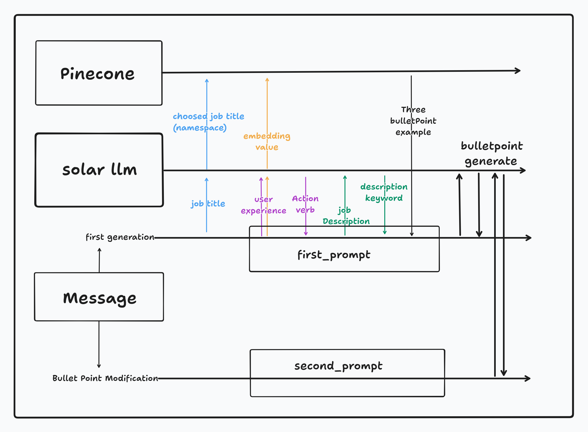

<a href="https://www.cvmate.site/">
  
  <h1 align="center">CVMATE</h1>
</a>
<br/>

## 프로젝트 개요
- Works across the entire [Next.js](https://nextjs.org) stack
  - App Router
  - Pages Router
  - Middleware
  - Client
  - Server
  - It just works!
- supabase-ssr. A package to configure Supabase Auth to use cookies
- Styling with [Tailwind CSS](https://tailwindcss.com)
- Optional deployment with [Supabase Vercel Integration and Vercel deploy](#deploy-your-own)
  - Environment variables automatically assigned to Vercel project

## 기술 스택

- **[Next.js](https://nextjs.org/)**: React 기반의 프레임워크로, 서버 사이드 렌더링과 정적 사이트 생성 등 다양한 기능을 지원.
- **[Supabase](https://supabase.com/)**: 실시간 데이터베이스, 인증 및 API 기능을 제공하는 백엔드 서비스 플랫폼.
- **[Pinecone](https://www.pinecone.io/)**: 임베딩 데이터베이스와 정보 검색 기능을 결합하여, RAG(Retrieval-Augmented Generation) 기능을 강화.
- **[SOLAR LLM](https://ko.upstage.ai/)**: 자연어 처리 및 텍스트 임베딩을 위한 LLM을 활용하여, CHAT 및 EMBEDDING 기능을 구현.

## 프로젝트 구조도
-**[프로젝트 구조도](https://www.tldraw.com/s/v2_c_6OIL_xyhLqdY8hOVt9tLB?d=v-3717.-2261.10707.5631.owtTHk2bAUkSlG696SNMj)**
-**AI 활용부분**



## DEMO

You can view a fully working demo at [cvmate.site](https://www.cvmate.site/).

## 설치 방법

1. **프로젝트 클론**

```bash
git clone https://github.com/juiceple/resume.git
```

2. DIRECTORY 이동

```bash
   cd name-of-new-app
```

3. 환경설정(API키 삽입)
   .env.local root directiory에 생성하기
   NEXT_PUBLIC_SUPABASE_URL= 
   NEXT_PUBLIC_SUPABASE_ANON_KEY=
   OPENAI_API_KEY=""
   SOLAR_API_KEY=""
   PINECONE_API_KEY=""

4. 필수 패키지 설치
   ```bash
   npm install
   ```

5. 개발 서버 실행
   ```bash
   npm run dev
   ```

>CVMATE를 [localhost:3000](http://localhost:3000/) 에서 실행됩니다.

## 사용 방법
1. 회원가입

2. /docs 부분으로 진입(회원가입 마지막 단계에서 버튼 클릭)

3. 새 이력서 생성

4. CLICKED TO BULLET POINT 부분을 누르면 AI 버튼 활성화

5. 버튼을 누른 후 FORM 제출

6. 완성된 BULLETPOINT에서 수정사항 요청


